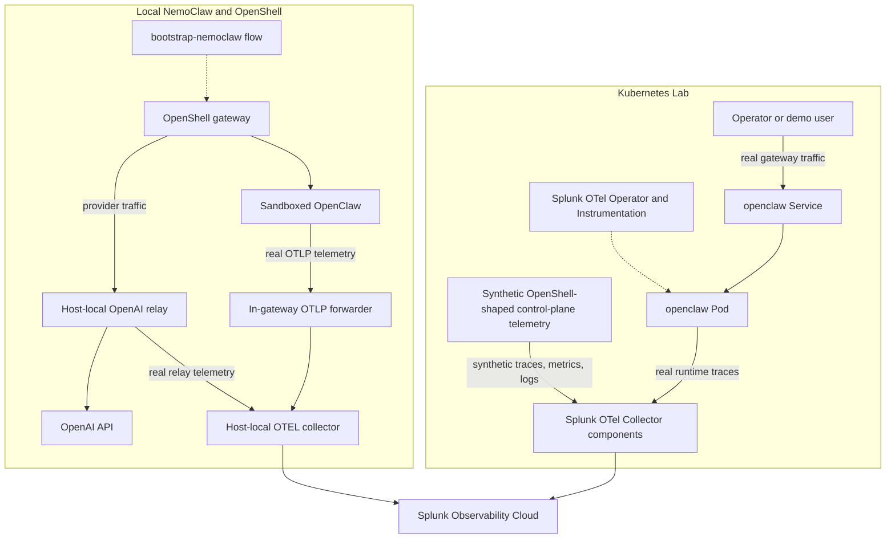
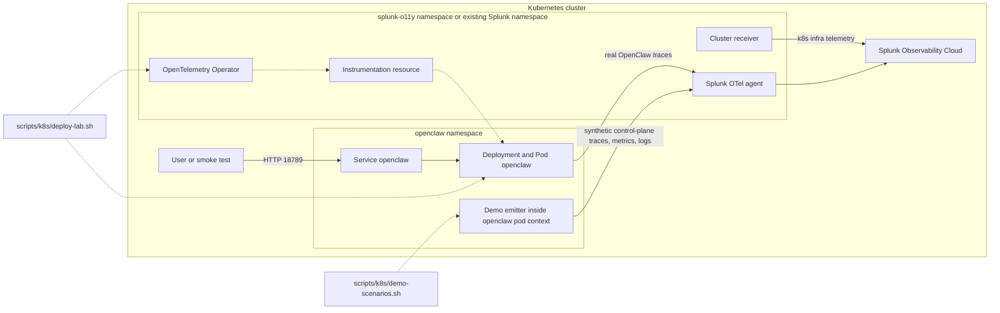
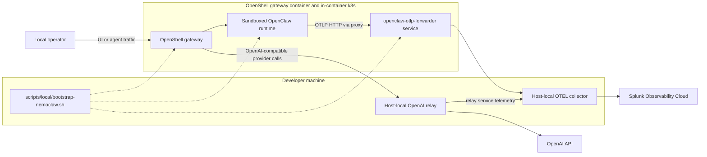

# OpenClaw O11y Architecture

This document captures the current architecture implemented in this repository.

Two paths exist today:

- The Kubernetes lab is the primary deployed runtime in this repo. It runs a real `openclaw` service, uses Splunk operator-based Node.js auto-instrumentation, and can emit additional synthetic OpenShell-shaped control-plane telemetry for demos.
- The local NemoClaw/OpenShell path is the real OpenShell runtime flow. It uses a host-local collector, a host-local OpenAI relay, and an in-gateway OTLP forwarder so sandboxed OpenClaw can export telemetry reliably.

Conventions used in the diagrams:

- Solid arrows show runtime request flow or telemetry export flow.
- Dashed arrows show setup, orchestration, or auto-instrumentation injection.
- Any path labeled `synthetic` is demo-generated telemetry rather than native OpenShell runtime telemetry.

## System Overview

## How OpenTelemetry Works

This repo uses OpenTelemetry in two different ways.

### Kubernetes Lab

1. `scripts/k8s/deploy-lab.sh` installs or reuses the Splunk OTel operator and an `Instrumentation` resource, then deploys OpenClaw with `instrumentation.opentelemetry.io/inject-nodejs`.
2. The operator mutates the OpenClaw pod at admission time. The running pod gets the `opentelemetry-auto-instrumentation-nodejs` init container and an injected Node.js bootstrap in `NODE_OPTIONS`.
3. The OpenClaw container still owns the service identity. The manifests set `OTEL_SERVICE_NAME=openclaw` and `OTEL_RESOURCE_ATTRIBUTES=deployment.environment=Openclaw`.
4. At runtime, the injected bootstrap exports spans to the Splunk OTel collector endpoint provided in `OTEL_EXPORTER_OTLP_ENDPOINT`. In the default lab shape, that is the node-local Splunk OTel agent service.
5. Real gateway traffic through port `18789` is what produces the useful APM spans. An injected pod with no traffic is not enough to make the service visible in Splunk APM.
6. `scripts/k8s/verify-lab.sh` validates the OTEL path by checking the deployment annotation, the injected init container, `NODE_OPTIONS`, `OTEL_EXPORTER_OTLP_ENDPOINT`, `OTEL_SERVICE_NAME`, and `OTEL_RESOURCE_ATTRIBUTES`.

### Local NemoClaw and OpenShell

1. `scripts/local/bootstrap-nemoclaw.sh` prepares the full local OTEL path: host collector, host OpenAI relay, in-gateway OTLP forwarder, policy preset, and a sandbox restart under instrumentation.
2. The sandboxed OpenClaw gateway is instrumented directly by the repo. It restarts `nemoclaw-start` with `NODE_OPTIONS=--require .../@splunk/otel/instrument.js`.
3. The same restart also enables Python-side coverage for NemoClaw helper processes by installing `splunk-opentelemetry`, writing a repo-owned `sitecustomize.py`, and prepending that bootstrap location to `PYTHONPATH`.
4. The local OpenClaw runtime exports traces with `OTEL_SERVICE_NAME=openclaw`, `OTEL_RESOURCE_ATTRIBUTES=deployment.environment=nemolaw,...`, `OTEL_EXPORTER_OTLP_PROTOCOL=http/protobuf`, and `OTEL_EXPORTER_OTLP_ENDPOINT` pointed at the in-gateway OTLP forwarder service.
5. The sandbox does not export directly to the host collector. It sends OTLP HTTP to `openclaw-otlp-forwarder`, and that forwarder relays traffic to the host-local collector on the gateway-reachable host endpoint.
6. The host OpenAI relay is instrumented as a separate `openai-relay` service and exports to the same host collector, which creates a real `openclaw -> openai-relay` service edge in Splunk APM.
7. `scripts/local/verify-nemoclaw-otel.sh` validates the OTEL path by checking the collector, relay, forwarder, gateway env, `NODE_OPTIONS`, `PYTHONPATH`, and the sandbox OTLP POST path.

### Signal Types In This Repo

- Real OpenClaw runtime traffic produces traces in both modes.
- The Kubernetes demo scenario flow also emits synthetic traces, metrics, and logs for `openshell-demo-control-plane`.
- The local OpenClaw and OpenAI relay paths are configured for traces only. The repo-managed local collector can also scrape and export `agent-sandbox-controller` Prometheus metrics when that endpoint is available.

## Kubernetes Lab Detail

This is the primary current-state deployment path in the repo. The OpenClaw gateway is real. The OpenShell-shaped control-plane telemetry is synthetic and is added by the demo scenario flow.

Key points for this path:

- `scripts/k8s/deploy-lab.sh` orchestrates Splunk OTel install or reuse, OpenClaw deployment, and the final instrumentation reference.
- `scripts/k8s/verify-lab.sh` validates the pod mutation, injected OTEL env, gateway listener, and authenticated smoke request.
- `scripts/k8s/demo-scenarios.sh` adds the synthetic `openshell-demo-control-plane` telemetry used for dashboards and detectors.

## Local NemoClaw and OpenShell Detail

This is the real OpenShell runtime path in the repo. The sandboxed gateway flow is real, and the OTLP forwarder exists so sandboxed OpenClaw can export telemetry to a gateway-reachable service instead of a host port.

Key points for this path:

- `scripts/local/ensure-collector.sh` reuses a compatible local collector or starts a repo-owned one.
- `scripts/local/ensure-openai-relay.sh` provides a gateway-reachable host relay when direct provider egress is constrained.
- `scripts/local/ensure-gateway-otlp-forwarder.sh` deploys the in-gateway forwarder that bridges sandbox OTLP traffic to the host collector.
- `scripts/local/verify-nemoclaw-otel.sh` verifies collector reachability, relay health, forwarder health, gateway OTEL env, and optional smoke-agent flows.

## Related Docs

- [README.md](../README.md) for deployment modes, prerequisites, and verification commands.
- [openshell-demo-path.md](./openshell-demo-path.md) for the demo telemetry contract, dashboard shape, and detector shape.
