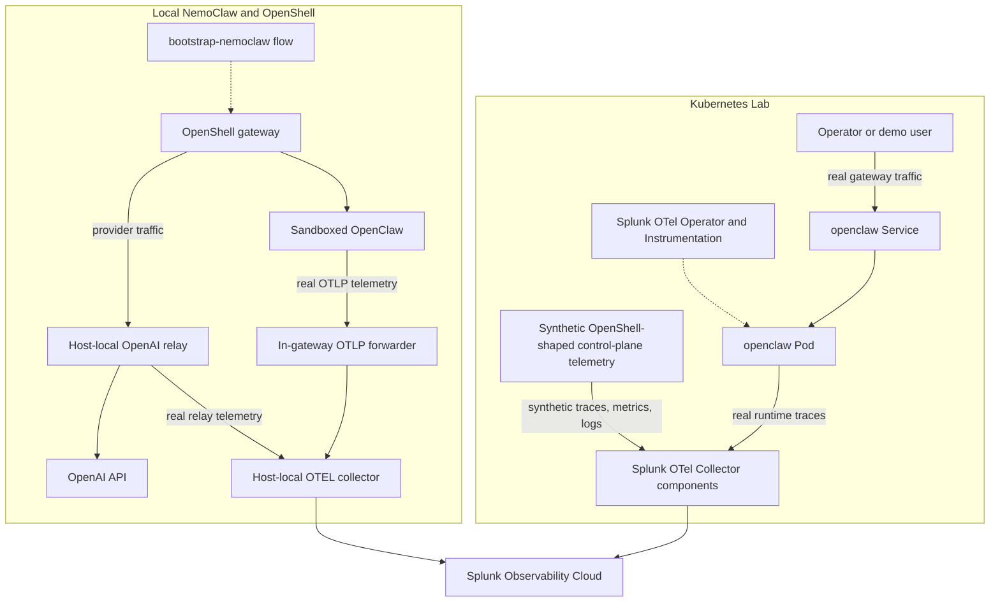
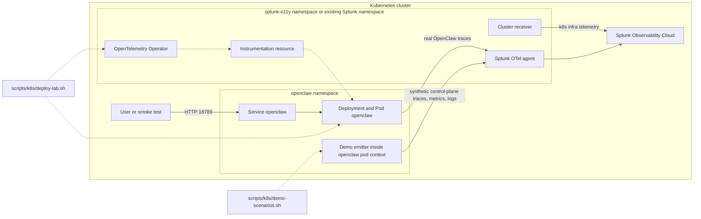
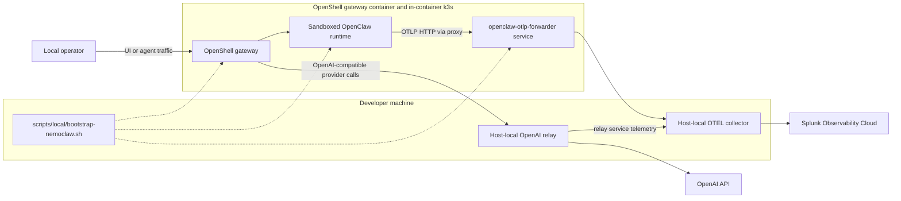

# OpenClaw O11y Architecture

This document captures the current architecture implemented in this repository.

Two paths exist today:

- The Kubernetes lab is the primary deployed runtime in this repo. It runs a real `openclaw` service, uses Splunk operator-based Node.js auto-instrumentation, and can emit additional synthetic OpenShell-shaped control-plane telemetry for demos.
- The local NemoClaw/OpenShell path is the real OpenShell runtime flow. It uses a host-local collector, a host-local OpenAI relay, and an in-gateway OTLP forwarder so sandboxed OpenClaw can export telemetry reliably.

Conventions used in the diagrams:

- Solid arrows show runtime request flow or telemetry export flow.
- Dashed arrows show setup, orchestration, or auto-instrumentation injection.
- Any path labeled `synthetic` is demo-generated telemetry rather than native OpenShell runtime telemetry.

## System Overview

## Kubernetes Lab Detail

This is the primary current-state deployment path in the repo. The OpenClaw gateway is real. The OpenShell-shaped control-plane telemetry is synthetic and is added by the demo scenario flow.

Key points for this path:

- `scripts/k8s/deploy-lab.sh` orchestrates Splunk OTel install or reuse, OpenClaw deployment, and the final instrumentation reference.
- `scripts/k8s/verify-lab.sh` validates the pod mutation, injected OTEL env, gateway listener, and authenticated smoke request.
- `scripts/k8s/demo-scenarios.sh` adds the synthetic `openshell-demo-control-plane` telemetry used for dashboards and detectors.

## Local NemoClaw and OpenShell Detail

This is the real OpenShell runtime path in the repo. The sandboxed gateway flow is real, and the OTLP forwarder exists so sandboxed OpenClaw can export telemetry to a gateway-reachable service instead of a host port.

Key points for this path:

- `scripts/local/ensure-collector.sh` reuses a compatible local collector or starts a repo-owned one.
- `scripts/local/ensure-openai-relay.sh` provides a gateway-reachable host relay when direct provider egress is constrained.
- `scripts/local/ensure-gateway-otlp-forwarder.sh` deploys the in-gateway forwarder that bridges sandbox OTLP traffic to the host collector.
- `scripts/local/verify-nemoclaw-otel.sh` verifies collector reachability, relay health, forwarder health, gateway OTEL env, and optional smoke-agent flows.

## Related Docs

- [README.md](../README.md) for deployment modes, prerequisites, and verification commands.
- [openshell-demo-path.md](./openshell-demo-path.md) for the demo telemetry contract, dashboard shape, and detector shape.
